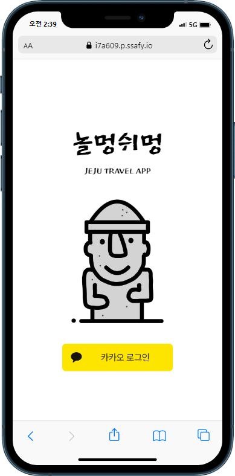
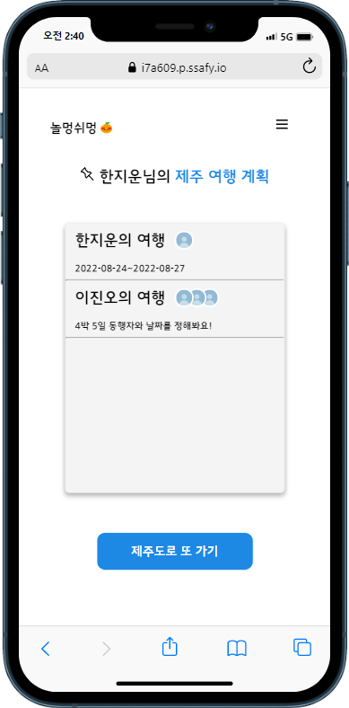

# 놀멍쉬멍

---

> 놀멍쉬멍은 “놀면서 쉬면서”라는 의미의 제주도 방언입니다.

## 📅프로젝트 진행 기간

---

2022.07.05 - 2022.08.19

## 💡기획 배경

---

컨슈머인사이트 여가 문화 체육 주례 조사에 따르면 코로나 거리두기 해제된 이후 관광 및 여행 관심도가 32%에서 61%로 가파르게 증가하였습니다. 내셔널지오그래픽 트래블러에 따르면 코로나 이후 응답자의 72%가 가장 가고 싶어하는 여행지로 제주도를 선택했습니다. 제주도를 쉽고 간편하게 여행할 수 있도록 도와주기 위해 서비스를 기획했습니다.

## 📍서비스 소개

---

서비스 이용자가 편안하게 여행만을 즐길 수 있도록, 제주 여행 계획 추천 서비스를 만들었습니다.
데이터베이스에 저장된 4천개 장소로, 여행 스타일에 맞는 계획을 추천해드립니다. 일상이 너무 바빠 여행을 계획할 시간조차 없는 사람들 혹은 여행 경로를 계획하는게 너무 귀찮은 사람들을 위해 놀멍쉬멍이 제주도에 도착할 때부터 제주도를 떠날 때까지 모든 경로를 계획해 드립니다.

## 💻사용 기술

### Backend

- JAVA 8(OpenJDK 1.8)
- SpringBoot 2.7.1
- Spring Security
- Spring Data JPA
- Swagger 3.0.0
- MYSQL 8.0.22

### Frontend

- JavaScript
- React 18.2.0
- Redux 8.0.2
- React-router-dom 6.3.0
- Node.js 16.16.0
- Socket.io

### CI/CD

- AWS EC2
- Docker
- Jenkins
- Nginx

### 협업 환경

- GitLab
- Jira
- MatterMost
- Discord
- Webex
- Notion

## 📖프로젝트 산출물

---

- ERD

[놀멍쉬멍 기능명세서.pdf](README%20bafa1a513c3944a5b3f90d712008a6a6/%25EB%2586%2580%25EB%25A9%258D%25EC%2589%25AC%25EB%25A9%258D_%25EA%25B8%25B0%25EB%258A%25A5%25EB%25AA%2585%25EC%2584%25B8%25EC%2584%259C.pdf)

## 📖프로젝트 결과물

---

[놀멍쉬멍_포팅메뉴얼.docx](README%20bafa1a513c3944a5b3f90d712008a6a6/%25EB%2586%2580%25EB%25A9%258D%25EC%2589%25AC%25EB%25A9%258D_%25ED%258F%25AC%25ED%258C%2585%25EB%25A9%2594%25EB%2589%25B4%25EC%2596%25BC.docx)

## 💎놀멍쉬멍 서비스 화면

---

### 회원가입

- 카카오톡을 이용하여 회원가입 및 로그인을 진행할 수 있습니다.

### 메인화면

- 현재 참여중인 여행 목록이 있을 경우 목록이 조회됩니다.
- 현재 참여중인 여행이 없을 경우 여행 명언이 표시됩니다.
- “제주도로 떠나기” 혹은 “제주도로 또 가기” 버튼을 눌러 여행을 생성할 수 있습니다.

### 여행 생성

- 동행자, 여행 기간, 여행 스타일, 전체 일정 시작 시간과 끝나는 시간을 작성합니다.

